# PANADERÍA

## Diagramas
### Casos de Uso de Negocio

### Diagrama de Actividad
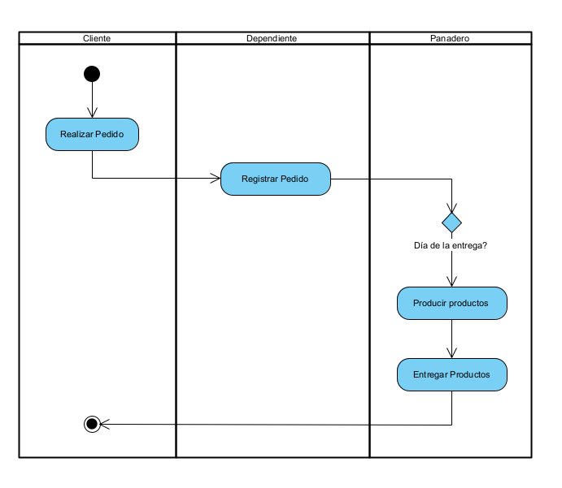

### Diagrama de Estado 
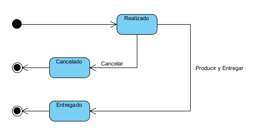

### Casos de Uso del Sistema

### Diagrama de Secuencia
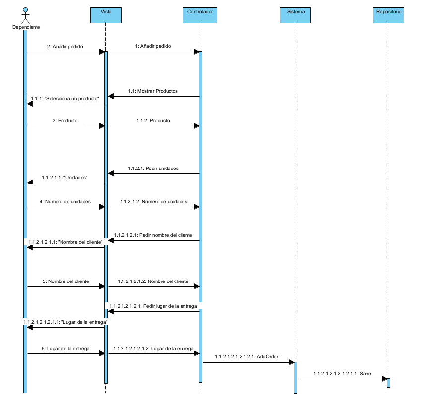

### Diagrama de Clases
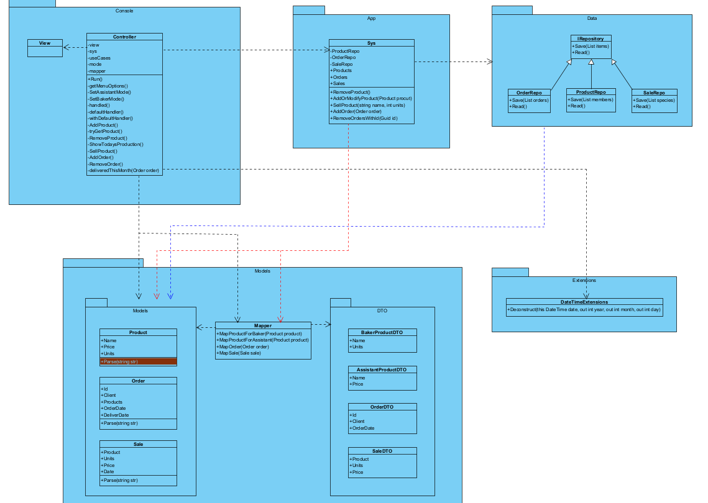

## Decisiones 
Éstas son las decisiones que se han tomado a la hora de realizar programa:
- El Panadero podrá consultar la producción para ese día, en base a los pedidos
que se hayan realizado y los productos que decide vender a diario.
- Además, podrá añadir (y eliminar) productos según considere necesario.
- No se llevará la cuenta de los ingredientes disponibles. 
- No se llevará la cuenta de los productos disponibles en la tienda.
- Cada vez que la Dependienta venda un producto, almacenamos la venta para, 
posteriormente, poder mostrar los ingresos de ese mes.
- Los clientes pueden realizar pedidos para una fecha determinada o pedidos
que se entregarán a diario.
- Todos los pedidos pueden ser encargados para ser entregados a partir del día
siguiente (siempre hay productos disponibles en el pueblo, según el panadero).
- Al parecer la mayoría de clientes pagan los pedidos en el momento de la entrega.
Los que no, siempre pagan uno o dos días después, así que los contamos como
si pagaran el mismo día.
- La Dependienta también nos dice que, a menudo, los clientes les piden productos
que no producen a diario, y que, por lo tanto, debería tener la capacidad de añadirlos
al pedido. 

## Capturas
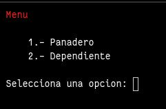
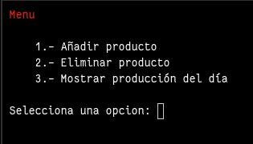  
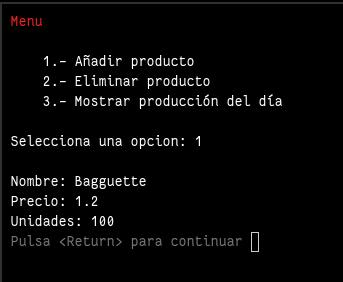  
  
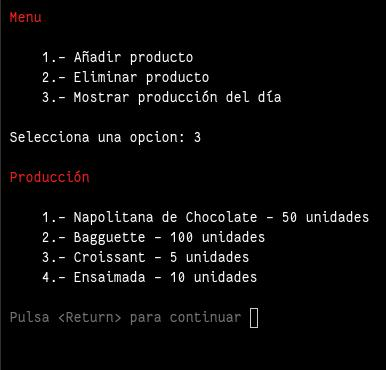  

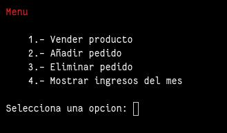  
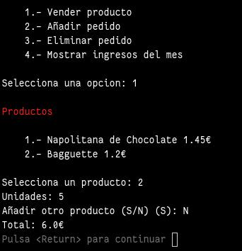  
  
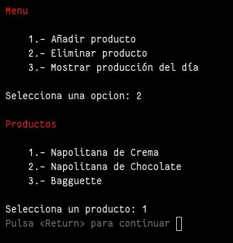  
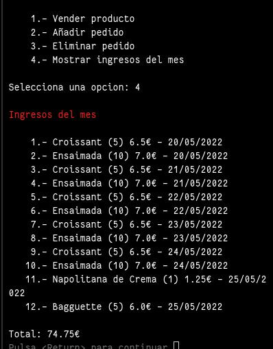  
